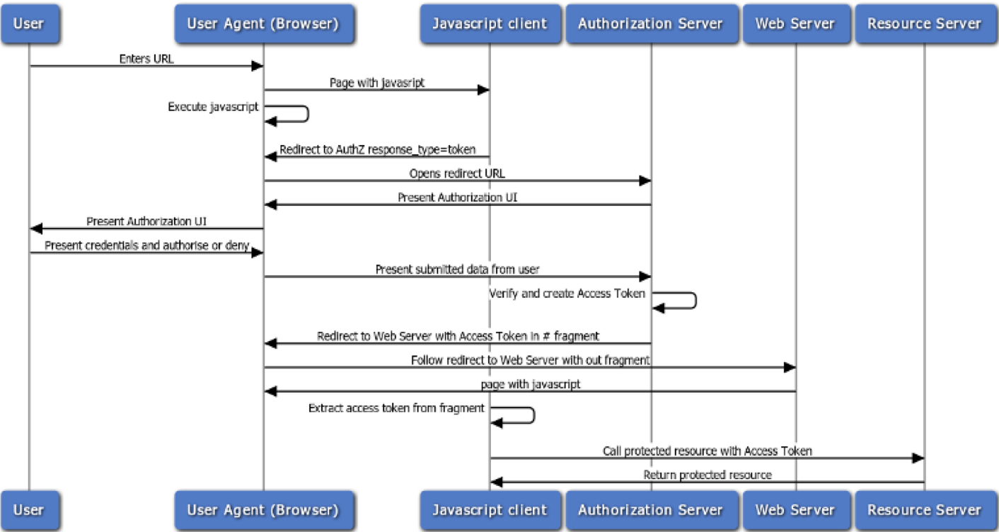
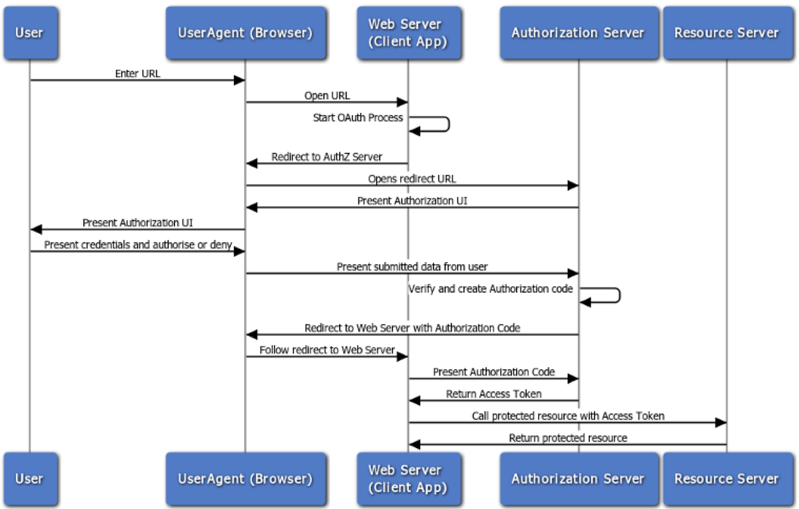
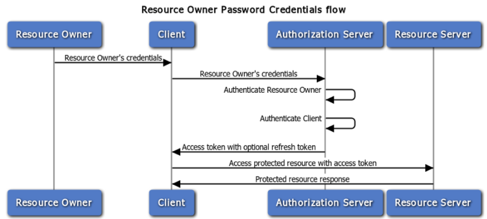

# Авторизация

- [Терминология](#терминология)
- [OAuth](#oauth)
- [JWT](#jwt)
- [Безопасность](#безопасность)
- [Полезные ссылки](#полезные-ссылки)

## Терминология

**Аутентификация (authentication)** — проверка подлинности — это процесс проверки учетных данных пользователя (обычно имени и пароля). Другими словами введенные учетные данные сверяются с данными, хранящимися в базе данных.

**Авторизация (authorization)** — это выделение пользователю ресурсов и/или прав доступа на основании указанных учетных данных, то есть после аутентификации.

## OAuth

**OAuth** — открытый протокол авторизации, который позволяет предоставить третьей стороне ограниченный доступ к защищенным ресурсам пользователя без необходимости передавать ей (третьей стороне) логин и пароль.

В стандарте OAuth 2.0 описаны следующие потоки (сценарии взаимодействия сторон):

- Поток неявного доступа (Implicit Grant Flow)
- Поток с кодом подтверждения (Authorization Code Flow)
- Поток с предоставлением клиенту пароля (Resource Owner Password Credentials Flow)
- Поток клиентских полномочий (Client Credentials Flow)
- Поток с обновляемым токеном (Refreshing an Expired Access Token Flow)

### Поток неявного доступа

### Поток с кодом подтверждения

### Поток с предоставлением клиенту пароля

### Поток клиентских полномочий

## JWT

**JWT** (**J**SON **W**eb **T**oken) — это открытый стандарт (RFC 7519) для создания токенов доступа, основанный на JSON формате.

Как правило, используется для передачи данных авторизации в клиент-серверных приложениях. Токены создаются сервером, подписываются секретным ключом и передаются клиенту, который в дальнейшем использует данный токен для подтверждения своей личности.

JWT содержит три блока, разделенных точками: заголовок (header), набор полей (payload) и сигнатуру.

**Преимущества:**

- JWT не требует хранения дополнительных данных о выданных токенах: все, что должен сделать сервер - это проверить подпись
- Сервер может не заниматься созданием токенов, а предоставить это внешним сервисам
- В JSON токенах можно хранить дополнительную полезную информацию о пользователях. Как следствие - более высокая производительность
- JWT делает возможным предоставление одновременного доступа к различным доменам и сервисам

### Заголовок

- `alg` — алгоритм, используемый  для  подписи / шифрования
- `typ` — тип  токена (type). Используется  в  случае, когда  токены  смешиваются  с  другими  объектами, имеющими JOSE заголовки.
- `cty` — тип  содержимого (content type). Если  в  токене  помимо  зарегистрированных  служебных  ключей  есть  пользовательские, то  данный  ключ  не  должен  присутствовать. В  противном  случае  должно  иметь  значение "JWT"

### Полезная нагрузка

- `iss` — уникальный  идентификатор  стороны, генерирующий  токен (issuer)
- `sub` — уникальный  идентификатором  стороны, о  которой  содержится  информация  в  данном  токене (subject)
- `aud` — список  получателей  данного  токена. Когда  принимающая  сторона  получает JWT с  данным  ключом, она  должна  проверить  наличие  себя  в  получателях - иначе  проигнорировать  токен (audience)
- `exp` — время  когда  токен  станет  не  валидным (expiration)
- `nbf` — время  когда  токен  станет  валидным (not before)
- `jti` — уникальный  идентификатор  данного  токена (JWT ID)

## Безопасность

### Аутентификация

- Не используйте Basic Auth. Используйте стандартную проверку подлинности (например: JWT, OAuth)
- Не "изобретайте колесо" в аутентификации, создании токенов, хранении паролей. Используйте стандарты
- Используйте `Max Retry`
- Используйте шифрование для всех конфиденциальных данных

### OAuth

- Всегда проверяйте `redirect_uri` на стороне сервера, чтобы разрешать только URL-адреса с белыми списками
- Всегда старайтесь обменивать код, а не токены (не разрешать `response_type=token`)
- Используйте параметр состояния со случайным хешем, чтобы предотвратить CSRF в процессе аутентификации OAuth
- Определите область по умолчанию и проверьте параметры области для каждого приложения

### JWT

- Используйте случайный сложный ключ (JWT Secret), чтобы сделать брутфорс токена очень сложным
- Не извлекайте алгоритм из **payload**. Внесите алгоритм в бэкэнд (HS256 или RS256)
- Сделайте срок действия токена (TTL, RTTL) как можно короче
- Не храните конфиденциальные данные в полезной нагрузке JWT, ее можно легко декодировать

### Доступ

- Ограничьте запросы (Throttling), чтобы избежать DDoS атак / грубой силы (Brute Force)
- Используйте HTTPS на стороне сервера, чтобы избежать MITM (Man In The Middle Attack / Атака посредника)
- Используйте заголовок HSTS (HTTP Strict Transport Security) с SSL, чтобы избежать атаки SSL Strip (перехват SSL соединений)

### Ввод

- Используйте соответствующий HTTP-метод в соответствии с операцией: GET (чтение), POST (создание), PUT / PATCH (замена / обновление) и DELETE (для удаления записи), а также ответьте `405 Method Not Allowed`, если запрошенный метод не подходит для запрашиваемого ресурса
- Подтвердите тип содержимого по запросу "Принять заголовок" (Консолидация контента), чтобы разрешить только поддерживаемый формат (например, `application/xml`, `application/json` и т.д.) И отвечайте с недопустимым ответом 406, если он не согласован
- Проверяйте содержимое опубликованных данных типа контента по мере их принятия (например, `application/x-www-form-urlencoded`, `multipart/form-data`, `application/json` и т.д.)
- Проверьте пользовательский ввод во избежание распространенных уязвимостей (например: XSS, SQL-инъекций, удаленное выполнение кода и т.д.)
- Не используйте конфиденциальные данные (учетные данные, пароли, маркеры безопасности или ключи API) в URL-адресе, но используйте стандартный заголовок авторизации
- Используйте службу шлюза API, чтобы активировать кеширование и ограничение скорости

### Обработка

- Проверьте, защищены ли все конечные точки за аутентификацией, чтобы не нарушить процедуру проверки подлинности
- Следует избегать идентификатора пользователя собственного ресурса. Используйте `/me/orders` вместо `/user/654321/orders`
- Не включайте автоинкремент для ID. Вместо этого используйте UUID
- Если вы разбираете XML-файлы, убедитесь, что синтаксический анализ сущностей не включен, чтобы избежать атаки на внешний объект XML (XML external entity)
- Не забудьте выключить режим DEBUG

### Вывод

- Отправляйте заголовок `X-Content-Type-Options: nosniff`
- Отправляйте заголовок `X-Frame-Options: deny`
- Отправляйте заголовок `Content-Security-Policy: default-src 'none'`
- Удалите заголовки информирования — `X-Powered-By`, `Server`, `X-Php-Version` и т.д.
- Принудите тип содержимого для вашего ответа, если вы вернете `application/json`, тогда ваш тип содержимого ответа будет `application/json`
- Возвращайте код состояния в соответствии с завершенной работой. (Например: `200 OK`, `400 Bad Request`, `401 Unauthorized`, `405 Method Not Allowed` и т.д.)

## Полезные ссылки

- [Официальный сайт OAuth](https://oauth.net)
- [Документация JWT](https://jwt.io)
- [Про токены, JSON Web Tokens (JWT), аутентификацию и авторизацию](https://gist.github.com/zmts/802dc9c3510d79fd40f9dc38a12bccfc)