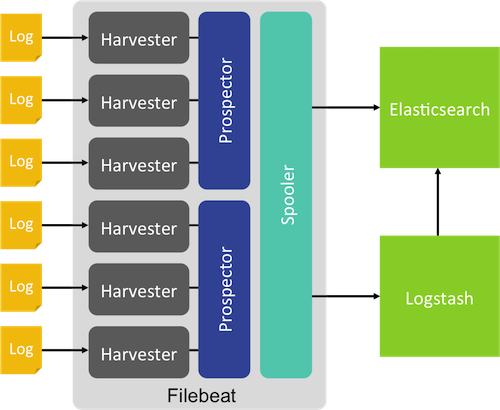

# Filebeat

- [Описание](#описание)
- [Установка](#установка)
- [Полезные ссылки](#полезные-ссылки)

## Описание

**Filebeat** — клиент для передачи логов в **Logstash**. Осуществляет анализ лог-данных в реальном режиме времени. Работает в совокупности с ELK стеком.




## Установка

```bash
# Установка
sudo apt install filebeat -y

# Установка плагинов для Elasticsearch
sudo /usr/share/elasticsearch/bin/elasticsearch-plugin install ingest-user-agent
sudo /usr/share/elasticsearch/bin/elasticsearch-plugin install ingest-geoip

# Запуск сервиса
sudo systemctl enable filebeat
sudo systemctl restart filebeat
```

Пример конфигурации для сбора Nginx логов — файл `etc/filebeat/filebeat.yml`:

```yml
filebeat.inputs:
- type: log
  # Change to true to enable this input configuration.
  enabled: false
  # Paths that should be crawled and fetched. Glob based paths.
  paths:
    - /var/log/nginx/*.log
  # Exclude files. A list of regular expressions to match.
  exclude_files: ['.gz$']

filebeat.config.modules:
  # Glob pattern for configuration loading
  path: ${path.config}/modules.d/*.yml
  # Set to true to enable config reloading
  reload.enabled: false

setup.template.settings:
  index.number_of_shards: 3

setup.kibana:
  # Kibana Host
  host: "localhost:5601"

output.elasticsearch:
  # Array of hosts to connect to.
  hosts: ["localhost:9200"]

processors:
  - add_host_metadata: ~
  - add_cloud_metadata: ~
```


## Полезные ссылки

- [Документация](https://www.elastic.co/guide/en/beats/filebeat/current/index.html)
- [How to Ingest Nginx Access Logs to Elasticsearch](https://sysadmins.co.za/how-to-ingest-nginx-access-logs-to-elasticsearch-using-filebeat-and-logstash/)