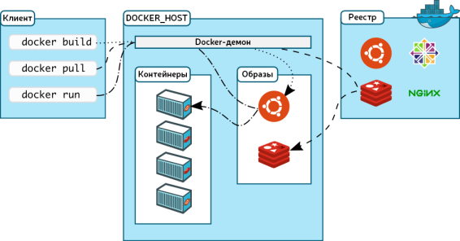
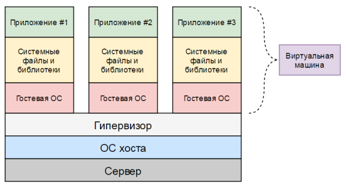
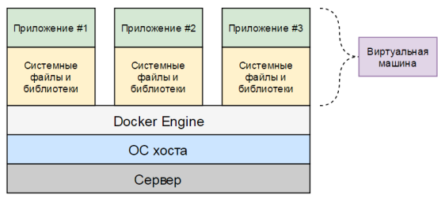

# Docker

- [Описание](#описание)
- [Архитектура](#архитектура)
- [Сравнение с виртуальными машинами](#сравнение-с-виртуальными-машинами)
- [Dockerfile](#dockerfile)
- [Docker Compose](#docker-compose)
- [Установка](#установка)
- [Команды](#команды)
- [Рекомендации](#рекомендации)
- [Docker Hub](#docker-hub)
- [Portainer](#portainer)
- [Полезные ссылки](#полезные-ссылки)

## Описание

**Docker** — программное обеспечение для автоматизации развертывания и управления приложениями в средах с поддержкой контейнеризации. Позволяет "упаковать" приложение со всем его окружением и зависимостями в контейнер, который может быть перенесен на любую Linux-систему с поддержкой `cgroups` в ядре, а также предоставляет среду по управлению контейнерами. Изначально использовал возможности LXC, с 2015 года применял собственную библиотеку, абстрагирующую виртуализационные возможности ядра Linux — `libcontainer`. С появлением ​Open Container Initiative начался переход от монолитной к модульной архитектуре. Написан на языке **Go**.

**Основные преимущества Docker:**

- **Простота использования.** Основанная на контейнерах Docker платформа позволят легко портировать полезную нагрузку. Docker контейнеры могут работать как на реальной локальной машине или машине в датацентре, так и на виртуальной машине в облаке. Портируемость и легковесная природа Docker позволяет легко динамически управлять нагрузкой. Можно использовать Docker, чтобы развернуть или погасить ваше приложение или сервисы. Скорость Docker позволяет делать это почти в режиме реального времени.
- **Скорость работы.** Docker-контейнеры легковесны и быстры. Можно создать и запустить Docker-контейнер за секунды, в отличии от виртуальных машин, каждый раз запускающих полноценную виртуальную ОС.
- **Модульность и масштабируемость.** Docker позволяет легко разделять функциональность приложения в отдельные контейнеры. Например, можно запускать базу данных Postgres в одном контейнере, хранилище Redis в другом, в то время как приложение Node.js находится в третьем. Это позволит легко масштабировать и обновлять компоненты приложения независимо друг от друга.  
 


## Архитектура

Программное обеспечение функционирует в среде Linux с ядром, поддерживающим `cgroups` и изоляцию пространств имен (namespaces).

Для экономии дискового пространства проект использует файловую систему **Aufs** с поддержкой технологии каскадно-объединенного монтирования: контейнеры используют образ базовой операционной системы, а изменения записываются в отдельную область. Также поддерживается размещение контейнеров в файловой системе **Btrfs** с включенным режимом копирования при записи.

В состав программных средств входит:

- **Демон** — сервер контейнеров (запускается командой docker -d)
- **Клиентские средства** — позволяют из интерфейса командной строки управлять образами и контейнерами
- **API** — позволяет в стиле REST управлять контейнерами программно

Демон обеспечивает полную изоляцию запускаемых на узле контейнеров на уровне файловой системы (у каждого контейнера собственная корневая файловая система), на уровне процессов (процессы имеют доступ только к собственной файловой системе контейнера, а ресурсы разделены средствами `libcontainer`), на уровне сети (каждый контейнер имеет доступ только к привязанному к нему сетевому пространству имен и соответствующим виртуальным сетевым интерфейсам).

Набор клиентских средств позволяет запускать процессы в новых контейнерах, останавливать и запускать контейнеры и т.д. Все команды могут работать как с docker-демоном локальной системы, так и с любым сервером Docker, доступным по сети.



Кроме того, в интерфейсе командной строки встроены возможности по взаимодействию с публичным репозиторием **Docker Hub**, в котором размещены предварительно собранные образы контейнеров.


## Сравнение с виртуальными машинами

### Виртуальная машина

**Виртуальная машина** — программная и/или аппаратная система, эмулирующая аппаратное обеспечение некоторой целевой гостевой и исполняющая программы для гостевой платформы на платформе-хозяине или виртуализирующая некоторую платформу и создающая на ней среды, изолирующие друг от друга программы и даже операционные системы. Виртуальные машины запускают на физических машинах, используя **гипервизор**. Гипервизор представляет собой часть программного или аппаратного обеспечения, обеспечивающую или позволяющую одновременное, параллельное выполнение нескольких операционных систем на одном и том же физическом компьютере, называемом "хост-компьютером" или "хостом". Хост предоставляет виртуальным машинам вычислительные ресурсы, легко распределяемые между ними.



Виртуальную машину, запускаемую на хосте, также часто называют "гостевой машиной". Гостевая машина содержат как приложение, так и все, что нужно для его запуска (например, системные исполняемые файлы и библиотеки). Она также несет в себе весь аппаратный стек, включая виртуальные сетевые адаптеры, файловое хранилище и центральный процессор, и свою собственную полноценную гостевую операционную систему. С внутренней стороны, гостевая машина ведет себя как свой собственный блок со своими собственными выделенными ресурсами. С внешней стороны это виртуальная машина, использующая общие ресурсы, предоставленные хостом.

### Контейнеры

В отличие от виртуальной машины, обеспечивающей аппаратную виртуализацию, контейнер обеспечивает виртуализацию на уровне операционной системы с помощью абстрагирования "пользовательского пространства". В целом, контейнеры выглядят как виртуальные машины. Например, у них есть изолированное пространство для запуска приложений, они позволяют выполнять команды с правами суперпользователя, имеют частный сетевой интерфейс и IP-адрес, пользовательские маршруты и правила межсетевого экрана и т. д. Одна большая разница между контейнерами и виртуальными машинами в том, что контейнеры разделяют ядро хоста с другими контейнерами.



Контейнеры упаковывают только пользовательское пространство, а не ядро или виртуальную аппаратуру, как это делают виртуальные машины. Каждый контейнер получает свое собственное изолированное пользовательское пространство для обеспечения возможности запуска нескольких контейнеров на одном хосте. Архитектура уровня операционной системы разделяется между контейнерами, именно поэтому контейнеры настолько легковесны.


## Dockerfile

В файлах `Dockerfile` содержатся инструкции по созданию образа. С них, набранных заглавными буквами, начинаются строки этого файла. После инструкций идут их аргументы. Инструкции, при сборке образа, обрабатываются сверху вниз.

Слои в итоговом образе создают только инструкции `FROM`, `RUN`, `COPY`, и `ADD`. Другие инструкции что-то настраивают, описывают метаданные, или сообщают Docker о том, что во время выполнения контейнера нужно что-то сделать, например — открыть какой-то порт или выполнить какую-то команду.

**Инструкции Dockerfile:**

1. `FROM` — задает базовый (родительский) образ. Сообщает Docker о том, чтобы при сборке образа использовался бы базовый образ, который соответствует предоставленному имени и тегу. Базовый образ, кроме того, еще называют родительским образом.
2. `LABEL` — описывает метаданные. Например — сведения о том, кто создал и поддерживает образ. Объявление меток не замедляет процесс сборки образа и не увеличивает его размер. Они лишь содержат в себе полезную информацию об образе Docker, поэтому их рекомендуется включать в файл.
3. `ENV` — устанавливает постоянные переменные среды, которые будут доступны в контейнере во время его выполнения. Инструкция хорошо подходит для задания констант.
4. `RUN` — выполняет команду и создает слой образа. После ее выполнения в образ добавляется новый слой, его состояние фиксируется. Инструкция часто используется для установки в образы дополнительных пакетов.
5. `COPY` — копирует в контейнер файлы и папки. Сообщает Docker о том, что нужно взять файлы и папки из локального контекста сборки и добавить их в текущую рабочую директорию образа. Если целевая директория не существует, эта инструкция ее создаст.
6. `ADD` — позволяет решать те же задачи, что и `COPY`. Также, с помощью этой инструкции можно добавлять в контейнер файлы, загруженные из удаленных источников, и распаковывать локальные .tar-файлы.
7. `CMD` — описывает команду с аргументами, которую нужно выполнить когда контейнер будет запущен. Аргументы могут быть переопределены при запуске контейнера. В файле может присутствовать лишь одна инструкция `CMD`.
8. `WORKDIR` — задает рабочую директорию для следующей инструкции. С этой директорией работают инструкции `COPY`, `ADD`, `RUN`, `CMD` и `ENTRYPOINT`.
9. `ARG` — задает переменные для передачи Docker во время сборки образа. В отличие от `ENV`-переменных, `ARG`-переменные недоступны во время выполнения контейнера.
10. `ENTRYPOINT` — предоставляет команду с аргументами для вызова во время выполнения контейнера. Похожа на команду `CMD`, но параметры, задаваемые в `ENTRYPOINT`, не перезаписываются в том случае, если контейнер запускают с параметрами командной строки.
11. `EXPOSE` — указывает на то, какие порты _планируется открыть_ для того, чтобы через них можно было бы связаться с работающим контейнером. Эта инструкция не открывает порты.
12. `VOLUME` — создает точку монтирования — место, которое контейнер будет использовать для постоянного хранения файлов и для работы с такими файлами.

Пример `Dockerfile` (сборка Django-приложения):

```
FROM python:3.7-slim

ENV PYTHONUNBUFFERED=1 PIP_DISABLE_PIP_VERSION_CHECK=on

COPY ./requirements.txt ./scripts/* /
COPY ./cpp /cpp
RUN DEPS="libpq-dev" \
    && BUILD_DEPS="build-essential libpcre3-dev libeigen3-dev" \
    && apt-get update && apt-get install -y --no-install-recommends $DEPS $BUILD_DEPS \
    && pip install --no-cache-dir -q -r requirements.txt \
    && apt-get purge -y --auto-remove -o APT::AutoRemove::RecommendsImportant=false $BUILD_DEPS \
    && rm -rf /var/lib/apt/lists/*

WORKDIR /app
COPY . .

EXPOSE 8000
```


## Docker Compose

**Docker Compose** — пакетный менеджер, позволяющий описывать и запускать многоконтейнерные приложения. Конфигурационные файлы Compose описываются на языке YAML.

Пример `docker-compose.yml` (сборка Django-приложения):

```yml
version: '2'

volumes:
  postgres_data: {}
  backend_staticfiles: {}
  backend_mediafiles: {}

services:
  postgres:
    image: postgres:10-alpine
    ports:
      - 8001:5432
    volumes:
      - postgres_data:/var/lib/postgresql/data
      - ./postgres/init.sh:/docker-entrypoint-initdb.d/init.sh
    networks:
      - default
      - db
    restart: always
    env_file: .env

  backend:
    build:
      context: ./backend
    volumes:
      - backend_staticfiles:/staticfiles/
      - backend_mediafiles:/mediafiles/
    command: /start_dev.sh
    entrypoint: /entrypoint.sh
    restart: always
    env_file: .env
    depends_on:
      - postgres

  nginx:
    build:
      context: .
      dockerfile: nginx/Dockerfile
    ports:
      - 8000:80
    volumes:
      - backend_staticfiles:/staticfiles/
      - backend_mediafiles:/mediafiles/
    restart: always
    depends_on:
      - backend

  backup:
    image: prodrigestivill/postgres-backup-local
    volumes:
      - ./DUMP:/backups/
    restart: always
    env_file: .env
    depends_on:
      - postgres

  monitoring-postgres:
    image: wrouesnel/postgres_exporter
    ports:
      - 8002:9187
    command:
      - --disable-settings-metrics
    env_file: .env
    restart: always
    depends_on:
      - postgres
```


## Установка

Установка Docker и Docker Compose:

```bash
# Ubuntu
curl -fsSL https://download.docker.com/linux/ubuntu/gpg | sudo apt-key add -
sudo add-apt-repository "deb [arch=amd64] https://download.docker.com/linux/ubuntu $(lsb_release -cs) stable"
sudo apt-get update
sudo apt-get install docker-ce docker-ce-cli containerd.io docker-compose
# macOS
brew install docker docker-compose docker-machine xhyve docker-machine-driver-xhyve
sudo chown root:wheel $(brew --prefix)/opt/docker-machine-driver-xhyve/bin/docker-machine-driver-xhyve
sudo chmod u+s $(brew --prefix)/opt/docker-machine-driver-xhyve/bin/docker-machine-driver-xhyve
```

Обновление Docker Compose до более новой версии:

```bash
sudo curl -L https://github.com/docker/compose/releases/download/1.24.0/docker-compose-`uname -s`-uname -m -o /usr/local/bin/docker-compose
sudo chmod +x /usr/local/bin/docker-compose
```


## Команды

### Docker

```bash
# Запустить процессы в новом контейнере
docker run
# Останавить контейнер
docker stop
# Запустить контейнер
docker start
# Приостановить процессы в контейнерах
docker pause
# Возобновить процессы в контейнерах
docker unpause
# Аналог "ps" в Unix-системах
docker ps
# Аналог "top" в Unix-системах
docker top
# Создать новый образ из файла "Dockerfile"
docker build
# Записать все изменения, сделанные в контейнере, в новый образ
docker commit

# Запуск контейнера в интерактивном режиме
docker run -it --rm -v ./:/tmp/bin python:2.7 /bin/bash/
# Запуск контейнера "portainer" в фоне на порту 9100
docker run -d -p 9100:9100 -v /var/run/docker.sock:/var/run/docker.sock --restart=always --name=portainer portainer/portainer --bind=":9100"
```

### Docker Compose

```bash
# Собрать контейнер(ы)
docker-compose build [container1]
# Запустить контейнер(ы) в фоне
docker-compose up -d [container1]
# Перезагрузить контейнер(ы)
docker-compose restart [container1]
# Масштабирование - запустить 5 копий одного контейнера
docker-compose scale container1=5
```


## Рекомендации

- Используйте всегда, когда это возможно, официальные образы в качестве базовых образов. Официальные образы регулярно обновляются, они безопаснее неофициальных образов.
- Для того чтобы собирать как можно более компактные образы, пользуйтесь базовыми образами, основанными на **Alpine Linux**.
- Если вы пользуетесь `apt`, комбинируйте в одной инструкции `RUN` команды `apt-get update` и `apt-get install`. Кроме того, объединяйте в одну инструкцию команды установки пакетов. Этот метод позволяет сократить число слоев, которые должны быть добавлены в образ, и помогает поддерживать код файла в приличном виде.
- Включайте конструкцию вида `&& rm -rf /var/lib/apt/lists/*` в конец инструкции `RUN`, используемой для установки пакетов. Это позволит очистить кэш `apt` и приведет к тому, что он не будет сохраняться в слое, сформированном командой `RUN`.
- Разумно пользуйтесь возможностями кэширования, размещая в Dockerfile команды, вероятность изменения которых высока, ближе к концу файла.
- Пользуйтесь файлом `.dockerignore`.
- Взгляните на `dive` — отличный инструмент для исследования образов Docker, который помогает в деле уменьшения их размеров.
- Не устанавливайте в образы пакеты, без которых можно обойтись.
- Используйте многоступенчатую сборку образов


## Docker Hub

**Docker Hub** — публичный реестр поддерживаемый "Docker, Inc". Он содержит образы которые можно скачать и использовать для создания контейнеров. А также обеспечивает проверку подлинности, структуру рабочей группы, инструменты рабочего процесса, такие как webhooks, триггеры и инструменты приватности, как частных хранилищ для хранения образов, которые нельзя делать публичными.

Также реестр образов можно установить на локальный сервер.

### Установка

Установка с помощью Docker — файл `docker-compose.yml`:

```yml
version: '2'

volumes:
  registry_data: {}

services:
  registry:
    image: registry:2
    ports:
    - 5000:5000
    environment:
      REGISTRY_STORAGE_FILESYSTEM_ROOTDIRECTORY: /data
    volumes:
      - registry_data:/data
```


## Portainer

**Portainer** — мощное решение для работы и конфигурирования Docker контейнеров. Представляет из себя web-приложение которое позволяет проводить настройку и манипуляции с контейнерами. В отличие от **Kitematic** и **Shipyard** имеет очень богатый функционал, который позволяет проводить очень качественную и полноценную настройку.

**Преимущества:**

- OpenSource
- Богатый функционал, который позволяет как полноценно настроить проект, так и управлять контейнерами этого проекта
- Позволяет подключаться к удаленным нодам и просматривать статистику контейнеров

### Установка

Установка с помощью Docker — файл `docker-compose.yml`:

```yml
version: '2'

volumes:
  portainer_data: {}

services:
  portainer:
    image: portainer/portainer
    ports:
      - 9100:9100
    volumes:
      - portainer_data:/data
      - /var/run/docker.sock:/var/run/docker.sock
    command: 
      - --bind=:9100
    restart: always
```


## Полезные ссылки

- [Документация Docker](https://docs.docker.com/)
- [Документация Docker Compose](https://docs.docker.com/compose/compose-file/)
- [Документация Portainer](https://portainer.readthedocs.io/en/stable/index.html)
- [Введение в контейнеры, виртуальные машины и Docker](https://moluch.ru/archive/123/33873/)
- [Изучаем Docker, часть 3: файлы Dockerfile](https://habr.com/ru/company/ruvds/blog/439980/)
- [Enabling and accessing Docker Engine API](https://medium.com/@sudarakayasindu/enabling-and-accessing-docker-engine-api-on-a-remote-docker-host-on-ubuntu-16-04-2c15f55f5d39)
- [How To Set Up a Private Docker Registry](https://www.digitalocean.com/community/tutorials/how-to-set-up-a-private-docker-registry-on-ubuntu-18-04)
- [How can I configure my reverse proxy to serve Portainer?](https://portainer.readthedocs.io/en/stable/faq.html#how-can-i-configure-my-reverse-proxy-to-serve-portainer)
